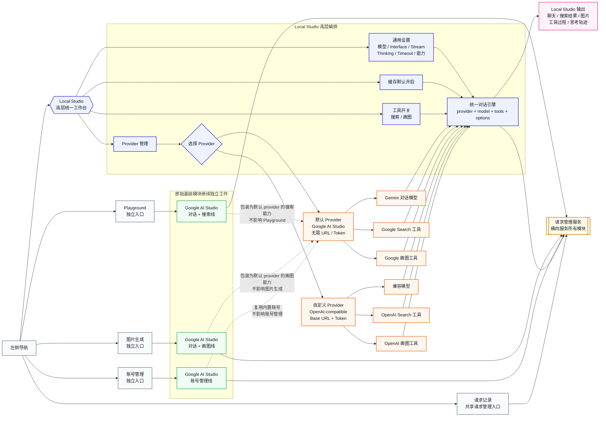
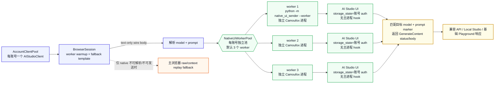
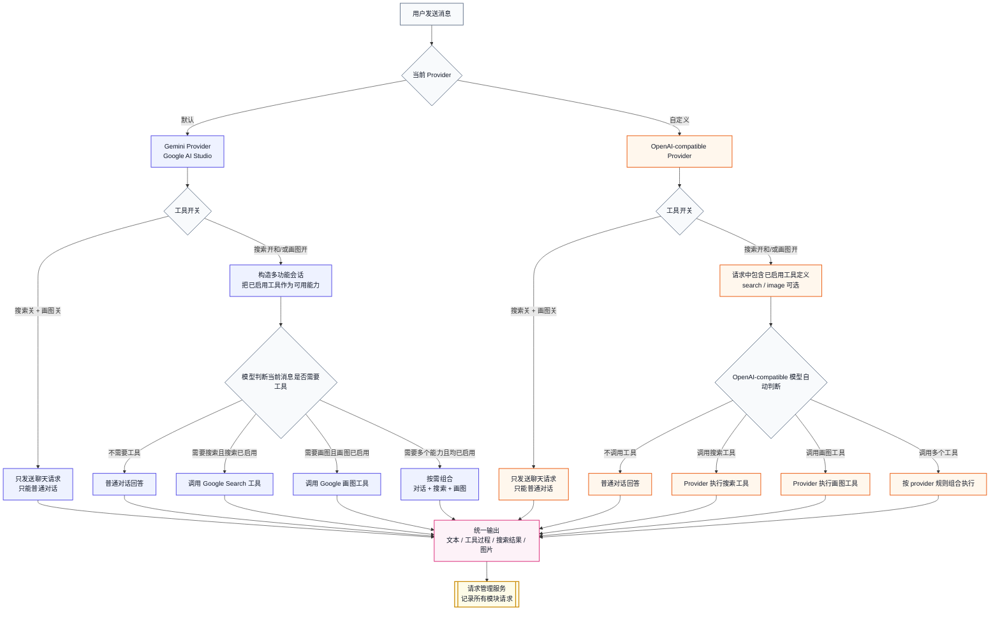
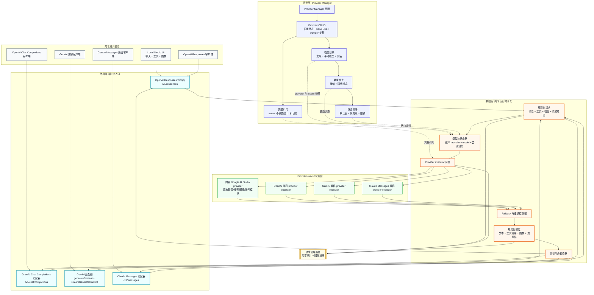

# Nexus Studio 架构

本文记录 Nexus Studio 当前 Local Studio 高层化改造的目标架构。重点是：原始基础模块保持独立可用，Local Studio 作为更高层的统一工作台复用这些能力，并通过 provider 与工具开关组织多功能会话。

## Local Studio 与 Google AI Studio 基础业务线

## Google AI Studio Native UI Worker Pool

Google AI Studio 账号态文本生成使用独立 native UI worker pool 作为可靠执行边界。这个边界服务 Local Studio 的 Google provider、OpenAI/Gemini/Claude 兼容入口中最终落到 Google AI Studio 文本 `GenerateContent` 的路径，也服务基础 Playground 文本路径；它不是 Local Studio 私有实现。

此前同一个 Python 进程里的 hook/template 捕获浏览器、隔离 context 和 raw replay 会共享 Playwright/Camoufox 进程状态；账号重新登录后，AI Studio 页面真实可用，但同进程 native/replay 仍可能返回 `403 permission`。当前架构把账号态文本发送移到每个账号自己的 native UI worker 子进程中：主进程只负责解析 AI Studio wire body，worker 子进程负责打开 AI Studio UI、选择模型、填入 prompt、点击运行并匹配真实 `GenerateContent` 响应。

关键运行契约：

- 每个账号的 `AIStudioClient` 拥有自己的 `BrowserSession`，因此 native UI worker pool 也是账号隔离的。账号启动 warmup 的成功门槛是该账号的 native UI worker pool 对 warmup text model 完成一次真实 `GenerateContent` probe；旧 hook/template capture 只作为 raw replay fallback 的兼容准备，不能再决定账号态文本 readiness。账号切换或账号 client 关闭时会终止旧 worker pool，避免旧 storage state 被继续使用。
- `AISTUDIO_NATIVE_UI_WORKERS_PER_ACCOUNT` 控制每个账号的 worker 数，默认 `3`；全局 `AISTUDIO_MAX_CONCURRENCY` 和账号 rotator 仍决定整体请求并发上限。单个 worker 一次只处理一个请求，同账号多个请求可租用不同 worker 并发执行。
- worker 子进程通过 JSONL 协议与主进程通信，命令入口为 `python -m aistudio_api.infrastructure.gateway.native_ui_sender --worker`。旧的一次性 stdin/stdout 模式保留用于诊断，但运行时账号态文本请求走 worker pool。
- worker 进程保留自己的 Camoufox/browser/context，并且不安装主进程的 transport hook/init script；这保留了修复账号 relogin 403 所需的 clean-process 权限边界，同时避免每次请求都重启 Python 和浏览器。
- native UI 成功匹配到目标 `GenerateContent` 后，其 HTTP status/body 是权威结果。即使 status 是 `401`、`403` 或 `429`，也按上游真实结果返回和分类，不能再先切到 raw replay 覆盖。
- native UI 仅支持可解析为纯文本 prompt 的 AI Studio wire body。包含 inline/file parts 或无法解析的 body 才允许回退到主浏览器 raw/context replay 兼容路径。
- worker UI 请求失败（例如冷页面尚未暴露目标模型选择器）按请求级失败处理：pool 会在不重启进程的情况下换用池内可用 worker 重试，最多覆盖配置的 worker 数。worker 进程退出、超时、stdout 协议损坏或返回 malformed body 时，pool 才重启对应 worker 并重试；仍失败时才进入上层 fallback/error 处理。

这个设计回答了两个同时存在的约束：可靠性上仍避开同进程 hook 污染，性能上则把“一请求一启动”的冷启动开销变成“每账号固定 worker 池复用”。

## Local Studio 统一对话引擎工具调用语义

工具开关表示允许模型使用该工具，不表示每次请求都强制调用工具。普通对话仍然可以保持普通对话；只有当用户请求确实需要搜索或画图时，才调用已启用的工具。

## Provider Manager 与共享 provider-model 池目标架构

下一阶段的架构目标，是把 provider 管理能力从 Local Studio 中抽离到独立的 Provider Manager 控制面，再让 Local Studio 和外部兼容 API 客户端通过运行时数据面消费同一套 provider-model 池。Local Studio 仍然是一等工作区，但它会从 provider 管理的所有者转为共享路由与执行能力的消费者之一。

Google AI Studio 继续作为内置 provider 存在。原有 Google AI Studio 基础模块仍然通过现有导航路径独立可用：Playground、图像生成、账号管理和请求日志保持各自当前的业务边界。内置 Google provider 会为共享池封装这些模块，但不会让 Local Studio 成为基础模块的依赖。

### 控制面职责

控制面是 provider-model 池的管理侧，由 Provider Manager 页面和配套 provider 服务负责；它应该在不进入 Local Studio 对话的情况下独立可用。

- Provider CRUD：创建、编辑、启用、停用和删除 provider 记录。内置 Google AI Studio provider 默认存在，不需要自定义 base URL 或 token。自定义 provider 可以先支持 OpenAI 兼容端点，随着共享池扩展，再接入 Gemini 兼容和 Claude Messages 兼容的 provider executor。
- 凭据处理：将 token、cookie、账号绑定或未来的 secret 引用与展示元数据分开存储。secret 不得返回给浏览器客户端，不得复制进请求日志，也不得出现在模型发现输出中。
- 模型发现与手动模型：当 provider 支持模型列表时自动发现模型；对不提供可靠模型列表端点的 provider，允许手动注册模型。每个模型条目应包含 provider 归属、外部模型 id、友好名称、能力、上下文限制、模态支持和可选别名。
- 健康检查：跟踪 provider 就绪状态、认证失败、模型可用性、配额耗尽、延迟降级和上次成功请求时间。健康状态影响路由，但不应删除 provider 配置。
- 路由策略配置：在 Local Studio 会话状态之外定义默认值、别名、权重、优先级、fallback 链、限流预算和兼容性要求。
- 审计与安全：对影响配置的操作更新请求管理记录，但不存储敏感凭据值。

### 数据面职责

数据面是运行时网关，负责接收兼容 API 请求，将其规范化，经模型池路由后执行 provider 调用，并把响应转换回调用方协议。

- 协议适配器：暴露 OpenAI Responses、OpenAI Chat Completions、Gemini generateContent 或 streamGenerateContent，以及 Claude Messages 兼容请求入口。每个适配器先校验自身原生请求形态，再映射为规范化请求。
- 规范化请求形态：用一种内部格式表达消息、system/developer 指令、工具定义、工具选择、流式意图、图像或文件、输出模态、采样选项、reasoning 或 thinking 选项、用户元数据，以及请求的模型选择器。
- 模型池路由器：解析别名和默认值，匹配能力，排序候选 provider-model 条目，应用健康与策略约束，并生成有序尝试计划。
- Provider executor：把规范化请求转换为所选 provider 的原生协议。Google AI Studio 作为内置 executor 使用现有基础模块；自定义 OpenAI 兼容 provider 使用 OpenAI 形态的 HTTP 调用；Gemini 与 Claude 兼容 executor 则转换到各自的消息和流式格式。
- Fallback 控制器：判断错误何时可重试、何时停留在同一 provider、何时 fallback 到其他 provider/model，以及流式响应期间如何保持调用方可见语义。
- 规范化响应形态：在协议专用转换前，捕获文本增量、最终文本、工具调用、工具结果、图像输出、用量、provider 尝试元数据、结束原因和错误。
- 响应转换：返回原始调用方期望的原生响应或流事件格式，包括 OpenAI Responses 事件、Chat Completions chunk、Gemini 流式 part 和 Claude Messages 内容块。

### 兼容协议入口

共享池在内部不绑定具体协议，但会在边界暴露兼容入口，让现有 AI 客户端无需理解 Nexus Studio 内部结构即可接入。

| 外部入口 | 入站职责 | 规范化映射重点 | 出站职责 |
| --- | --- | --- | --- |
| OpenAI Responses | 接收 response 创建、流式请求、多模态输入、工具声明和 response format 选项。 | 将 instructions、input item、tools、stream intent、model alias 和 modalities 映射到规范化请求字段。 | 输出 Responses object 或流事件，并包含转换后的 output item、工具调用、用量和结束状态。 |
| OpenAI Chat Completions | 接收 chat messages、system prompt、tools/functions、tool choice、streaming 和 sampling 选项。 | 将 role、message content part、tools、tool-call id 和 model selector 映射到规范化请求字段。 | 输出 Chat Completions response 或 chunk，保留 choices、delta、工具调用、用量和 finish reason。 |
| Gemini | 接收 generateContent 和 streamGenerateContent 风格的 content、part、generation config、safety setting，以及受支持的工具。 | 将 contents、parts、function declaration、generation config、模态输入和模型名映射到规范化请求字段。 | 输出 Gemini 兼容 candidates、parts、可用的 safety metadata 和流式更新。 |
| Claude Messages | 接收 messages、system prompt、tools、tool choice、streaming、max tokens 和 content block。 | 将 content block、thinking/tool 兼容性、model selector 和 stop condition 映射到规范化请求字段。 | 输出 Claude 兼容 message response 或 stream event，包含 text block、tool-use block、用量和 stop reason。 |

### 路由策略考量

路由策略是 Provider Manager 配置与运行时执行之间的契约。路由器应基于策略快照和请求元数据做出确定性决策，并把选定的尝试计划记录到请求管理日志中。

- 别名与默认值：支持全局默认值、按协议的默认值、Local Studio 默认值，以及 `default`、`fast`、`vision` 或项目专用名称等别名；这些别名可解析为一个或多个 provider-model 候选项。
- 能力匹配：在候选项可被选中之前，要求模型支持文本聊天、流式输出、工具/函数调用、图像输入、图像生成、搜索 grounding、reasoning 或 thinking 选项、结构化输出、上下文长度和文件处理等所需能力。
- 健康与就绪：按策略排除已停用 provider、不健康凭据、耗尽账号或降级模型。只有调用方或管理员明确请求时才允许显式覆盖。
- 配额与限流：考虑 provider 级、凭据级、账号级、模型级和客户端级预算。路由器应避免选择因活跃限流窗口而已知不可用的候选项。
- 优先级与权重：用优先级表达有序 fallback 偏好，用权重在等价候选项之间做负载分配。健康或配额状态可以临时降低候选项的有效权重。
- 成本与延迟：允许策略偏向更低延迟、更低成本、更高质量或均衡路由。当 provider 暴露足够用量数据时，应按每次尝试记录成本和延迟。
- 粘性行为：可选地让某个对话、客户端或会话在 provider-model 保持健康时继续使用同一候选项，以降低行为漂移。粘性路由仍必须遵守硬性能力、配额和凭据失败约束。
- Fallback 行为：定义哪些错误可重试，哪些错误需要切换同一 provider 下的不同凭据，哪些错误需要切换模型，哪些错误必须直接返回给调用方。流式 fallback 只有在任何不可撤销响应 chunk 发送前才是安全的。
- 流式、工具与图像兼容性：除非策略定义的适配器可以保持语义，否则不要把流式请求路由到非流式 executor，不要把工具请求路由到缺少兼容工具调用语义的模型，不要把图像输入请求路由到纯文本模型，也不要把图像生成请求路由到仅聊天模型。

### 抽离后的 Local Studio 边界

Local Studio 应从共享池读取 provider/model 可用性，并且只存储对话范围内的选择：选定模型别名、启用的工具、界面设置、流式偏好、thinking 选项、超时、缓存偏好和其他会话级选项。它不应再拥有 provider CRUD、凭据、模型发现或全局路由策略。

其他 AI 客户端可以通过 OpenAI Responses、OpenAI Chat Completions、Gemini 或 Claude Messages 兼容 API 调用同一个共享池。这些客户端应获得协议原生行为，同时共享 Local Studio 使用的同一套健康状态、凭据、模型目录、路由策略、请求日志和 provider executor 基础设施。

### Google AI Studio 基础模块约束

Google AI Studio 集成仍然是内置 provider，而不是 Local Studio 的实现细节。现有 Playground、图像生成、账号管理和请求日志路径必须保持独立可用。Provider Manager 可以把 Google AI Studio 展示为始终可用的 provider 记录，并从现有模块读取账号/模型健康状态，但不得把基础模块工作流迁移到只属于 Local Studio 的状态之后。

### 落地边界

- 文档任务边界：本章节只是目标架构，不引入后端路由、存储迁移、Provider Manager UI 代码或 executor 变更。
- 第一阶段实现边界：创建 Provider Manager 配置入口和 provider/model registry 抽象，同时通过兼容适配器保留当前 Local Studio 行为。
- 第二阶段实现边界：把运行时请求选择迁移到共享模型池，并让 Local Studio 通过与外部兼容客户端相同的网关消费它。
- 后续实现边界：增加高级路由策略、provider 健康自动化、配额感知负载均衡、成本/延迟评分、粘性路由和受控流式 fallback。
- 兼容性边界：每个落地步骤都必须保持原有 Google AI Studio 基础模块独立可用，并保留跨模块的现有请求管理可见性。
