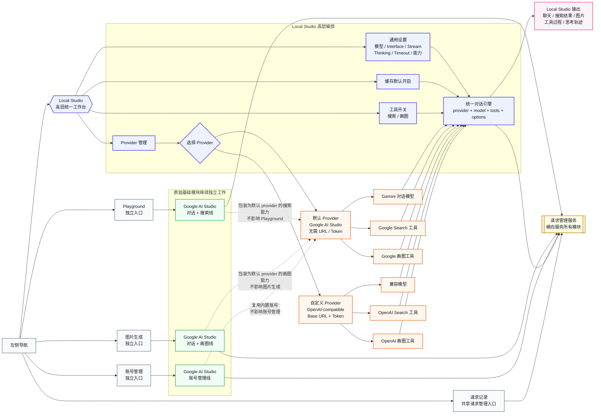
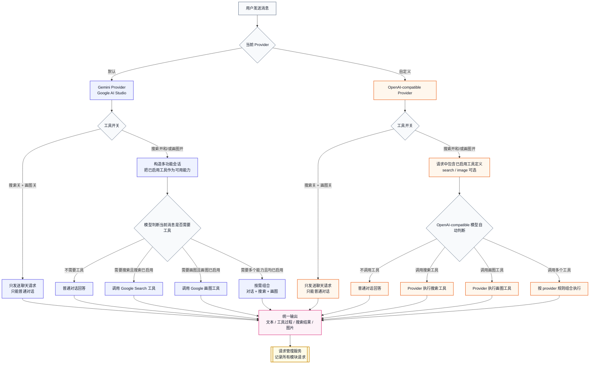
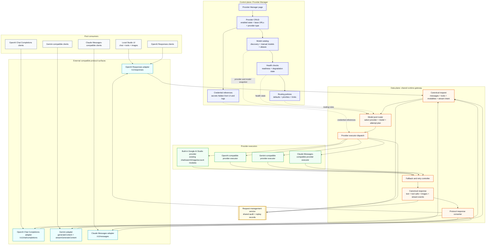

# Nexus Studio 架构

本文记录 Nexus Studio 当前 Local Studio 高层化改造的目标架构。重点是：原始基础模块保持独立可用，Local Studio 作为更高层的统一工作台复用这些能力，并通过 provider 与工具开关组织多功能会话。

## Local Studio 与 Google AI Studio 基础业务线

## Local Studio 统一对话引擎工具调用语义

工具开关表示允许模型使用该工具，不表示每次请求都强制调用工具。普通对话仍然可以保持普通对话；只有当用户请求确实需要搜索或画图时，才调用已启用的工具。

## Provider Manager and Shared Provider-Model Pool Target Architecture

The next architecture step is to move provider administration out of Local Studio into a dedicated Provider Manager control plane, then let Local Studio and external compatible API clients consume the same provider-model pool through a runtime data plane. Local Studio remains a first-class workspace, but it becomes one consumer of shared routing and execution instead of the owner of provider management.

Google AI Studio stays as the built-in provider. The original Google AI Studio base modules still remain independently usable through their existing navigation paths: Playground, image generation, account management, and request logs keep their current business boundaries. The built-in Google provider wraps those modules for the shared pool without making Local Studio a dependency of the base modules.

### Control Plane Responsibilities

The control plane is the administrative side of the provider-model pool. It is owned by the Provider Manager page and supporting provider services, and it should be usable without entering a Local Studio conversation.

- Provider CRUD: create, edit, enable, disable, and delete provider records. The built-in Google AI Studio provider is present by default and does not require a custom base URL or token. Custom providers can include OpenAI-compatible endpoints first, with Gemini-compatible and Claude Messages-compatible provider executors available as the pool grows.
- Credential handling: store tokens, cookies, account bindings, or future secret references separately from display metadata. Secrets must not be returned to browser clients, copied into request logs, or included in model discovery output.
- Model discovery and manual models: discover provider models when the provider supports listing, and allow manual model registration for providers that do not expose reliable model-list endpoints. Each model entry should include provider ownership, external model id, friendly name, capabilities, context limits, modality support, and optional aliases.
- Health checks: track provider readiness, authentication failures, model availability, quota exhaustion, latency degradation, and last successful request time. Health state informs routing, but it should not delete provider configuration.
- Routing policy configuration: define defaults, aliases, weights, priorities, fallback chains, rate-limit budgets, and compatibility requirements outside Local Studio session state.
- Audit and safety: update request management records for configuration-affecting actions without storing sensitive credential values.

### Data Plane Responsibilities

The data plane is the runtime gateway that receives compatible API requests, normalizes them, routes them through the model pool, executes provider calls, and converts responses back to the caller protocol.

- Protocol adapters: expose OpenAI Responses, OpenAI Chat Completions, Gemini generateContent or streamGenerateContent, and Claude Messages-compatible request surfaces. Each adapter validates its native request shape before mapping into the canonical request.
- Canonical request shape: represent messages, system/developer instructions, tool definitions, tool choice, streaming intent, images or files, output modalities, sampling options, reasoning or thinking options, user metadata, and the requested model selector in one internal format.
- Model pool router: resolve aliases and defaults, match capabilities, rank candidate provider-model entries, apply health and policy constraints, and create an ordered attempt plan.
- Provider executors: translate the canonical request to the selected provider's native protocol. Google AI Studio uses the existing base modules as the built-in executor; custom OpenAI-compatible providers use OpenAI-shaped HTTP calls; Gemini and Claude-compatible executors translate to their own message and stream formats.
- Fallback controller: decide when an error is retryable, when to stay on the same provider, when to fall back to another provider/model, and how to preserve caller-visible semantics during streaming.
- Canonical response shape: capture text deltas, final text, tool calls, tool results, image outputs, usage, provider attempt metadata, finish reasons, and errors before protocol-specific conversion.
- Response conversion: return the native response or stream event format expected by the original caller, including OpenAI Responses events, Chat Completions chunks, Gemini stream parts, and Claude Messages content blocks.

### Compatible Protocol Surfaces

The pool is protocol-agnostic internally, but compatibility is exposed at the edges so existing AI clients can connect without knowing about Nexus Studio internals.

| External surface | Inbound responsibility | Canonical mapping focus | Outbound responsibility |
| --- | --- | --- | --- |
| OpenAI Responses | Accept response creation, streaming, multimodal input, tool declarations, and response-format options. | Map instructions, input items, tools, stream intent, model aliases, and modalities into canonical request fields. | Emit Responses objects or streaming events with converted output items, tool calls, usage, and finish state. |
| OpenAI Chat Completions | Accept chat messages, system prompts, tools/functions, tool choice, streaming, and sampling options. | Map roles, message content parts, tools, tool-call ids, and model selectors into canonical request fields. | Emit Chat Completions responses or chunks, preserving choices, deltas, tool calls, usage, and finish reasons. |
| Gemini | Accept generateContent and streamGenerateContent style content, parts, generation config, safety settings, and tools where supported. | Map contents, parts, function declarations, generation config, modality inputs, and model names into canonical request fields. | Emit Gemini-compatible candidates, parts, safety metadata where available, and streaming updates. |
| Claude Messages | Accept messages, system prompt, tools, tool choice, streaming, max tokens, and content blocks. | Map content blocks, thinking/tool compatibility, model selector, and stop conditions into canonical request fields. | Emit Claude-compatible message responses or stream events with text blocks, tool-use blocks, usage, and stop reasons. |

### Routing Policy Considerations

Routing policy is the contract between Provider Manager configuration and runtime execution. The router should make deterministic decisions from a policy snapshot and request metadata, then record the selected attempt plan in request management logs.

- Aliases and defaults: support global defaults, per-protocol defaults, Local Studio defaults, and aliases such as `default`, `fast`, `vision`, or project-specific names that resolve to one or more provider-model candidates.
- Capability matching: require model support for text chat, streaming, tool/function calling, image input, image generation, search grounding, reasoning or thinking options, structured output, context length, and file handling before a candidate can be selected.
- Health and readiness: exclude disabled providers, unhealthy credentials, exhausted accounts, or degraded models according to policy. Allow explicit override only when the caller or administrator requests it.
- Quotas and rate limits: consider provider-level, credential-level, account-level, model-level, and per-client budgets. The router should avoid selecting a candidate that is known to be unavailable because of active limit windows.
- Priority and weight: use priority for ordered fallback preference and weight for load distribution among equivalent candidates. Health or quota state can temporarily reduce a candidate's effective weight.
- Cost and latency: allow policy to prefer lower latency, lower cost, higher quality, or balanced routing. Cost and latency should be recorded per attempt when providers expose enough usage data.
- Sticky behavior: optionally keep a conversation, client, or session on the same provider-model while it remains healthy to reduce behavior drift. Sticky routing must still respect hard capability, quota, and credential failures.
- Fallback behavior: define which errors are retryable, which require a different credential on the same provider, which require a different model, and which must be returned directly to the caller. Streaming fallback is only safe before any irreversible response chunk has been sent.
- Streaming, tool, and image compatibility: do not route streaming requests to non-streaming executors, tool requests to models without compatible tool-call semantics, image-input requests to text-only models, or image-generation requests to chat-only models unless a policy-defined adapter can preserve semantics.

### Local Studio Boundary After Extraction

Local Studio should read provider/model availability from the shared pool and store only conversation-scoped choices: selected model alias, enabled tools, interface settings, stream preference, thinking options, timeout, cache preference, and other per-session options. It should no longer own provider CRUD, credentials, model discovery, or global routing policy.

Other AI clients can call the same pool through OpenAI Responses, OpenAI Chat Completions, Gemini, or Claude Messages-compatible APIs. Those clients should receive protocol-native behavior while sharing the same health, credential, model catalog, routing policy, request logging, and provider executor infrastructure used by Local Studio.

### Google AI Studio Base Module Constraint

The Google AI Studio integration remains the built-in provider, not an implementation detail of Local Studio. The existing Playground, image generation, account management, and request log paths must keep working independently. Provider Manager can surface Google AI Studio as an always-available provider record and can read account/model health from the existing modules, but it must not move the base module workflows behind Local Studio-only state.

### Rollout Boundaries

- Documentation task boundary: this section is target architecture only. It does not introduce backend routes, storage migrations, Provider Manager UI code, or executor changes.
- First implementation boundary: create Provider Manager configuration surfaces and provider/model registry abstractions while preserving current Local Studio behavior through compatibility adapters.
- Second implementation boundary: move runtime request selection to the shared model pool and make Local Studio consume it through the same gateway as external compatible clients.
- Later implementation boundary: add advanced routing policies, provider health automation, quota-aware load balancing, cost/latency scoring, sticky routing, and controlled streaming fallback.
- Compatibility boundary: every rollout step must keep original Google AI Studio base modules independently usable and must preserve existing request management visibility across modules.
