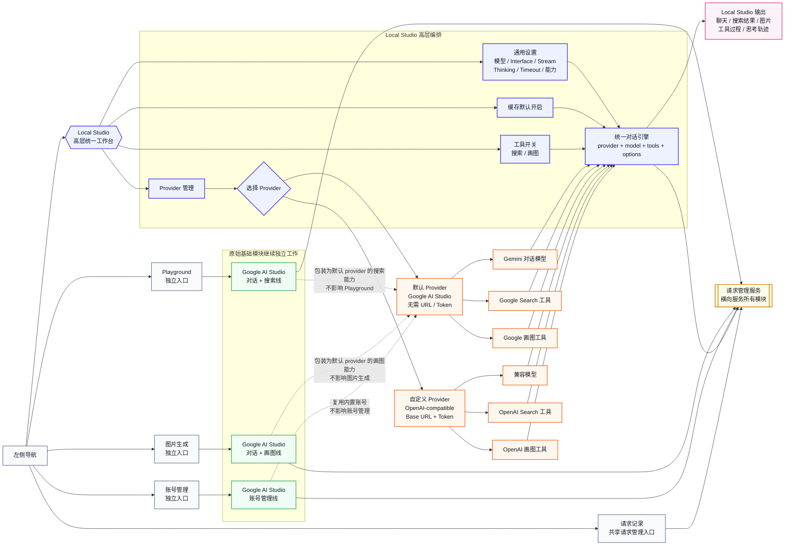
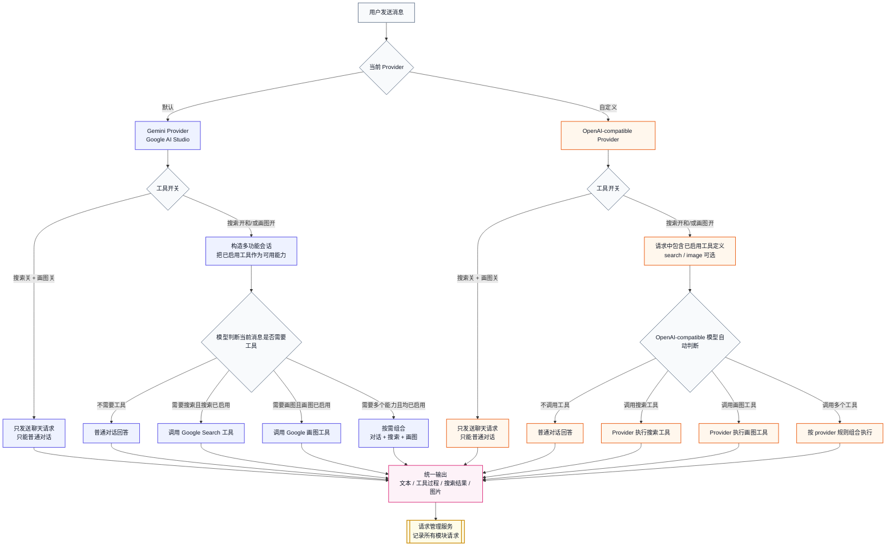

# Nexus Studio 架构

本文记录 Nexus Studio 当前 Local Studio 高层化改造的目标架构。重点是：原始基础模块保持独立可用，Local Studio 作为更高层的统一工作台复用这些能力，并通过 provider 与工具开关组织多功能会话。

## Local Studio 与 Google AI Studio 基础业务线

## Local Studio 统一对话引擎工具调用语义

工具开关表示允许模型使用该工具，不表示每次请求都强制调用工具。普通对话仍然可以保持普通对话；只有当用户请求确实需要搜索或画图时，才调用已启用的工具。

